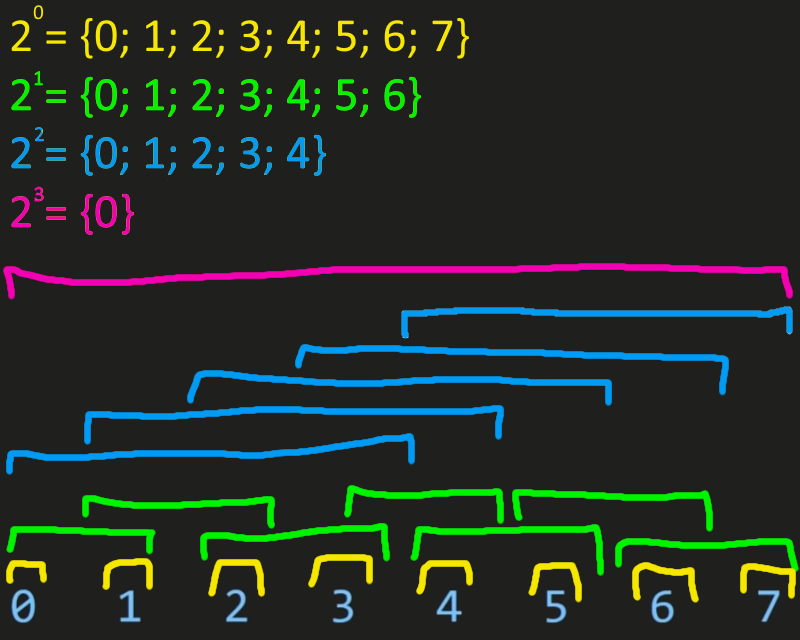
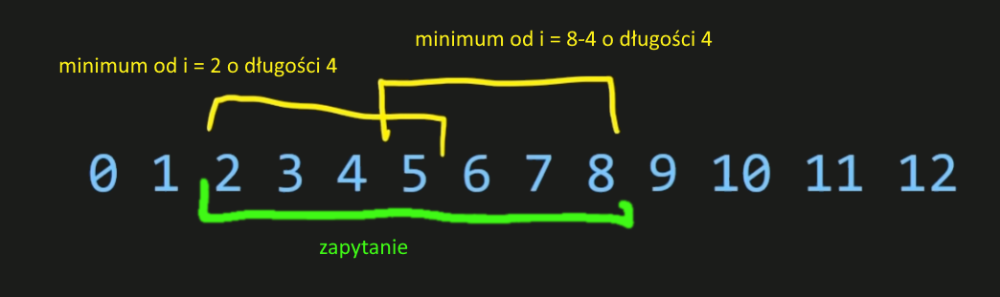

[Wróć](../../../../../../)

# Sparse table (range minimum query)

Jest to struktura, która umożliwia odpowiadanie na pytania na przedziale. Przeważnie działa w czasie $O(\log{n})$.
Jednak jej głównym zastosowaniem jest odpowiadanie na zapytania o minimum (i nie tylko) na przedziale w czasie stałym, jednak zmiana elementu w tablicy będzie wymagała ponownego policzenia całej struktury.

## Działanie
Działanie jest podobne do binary liftingu - dla każdej *potęgi dwójki = k* liczymy minimum na przedziale od *i* do *k*, dla *i* iterującego się po elementach tablicy. \
Aby przyspieszyć obliczenia możemy użyć dynamicznego programowania, i każdą kolejną potęgę liczyć jako minimum 2 mniejszych na nią się składających.



Aby odczytać minimum na przedziale wystarczy wziąć pierwszą potęgę dwójki mniejszą od długości zapytania i wziąć minimum wyniku dla *długości = tej potędze* policzonej od początku i od końca zapytania.



## Algorytm
### Obliczanie struktury $O(n\log{n})$
Wyniki obliczeń zapiszemy w dwówymiarowej tablicy *minima[n][k]*, gdzie n to długość tablicy i $k \geqq \lfloor\log_{2}n\rfloor$, tak aby $2^{\lfloor\log_{2}n\rfloor}$ było największą potęgą mieszczącą się w tablicy. \
Iterując się po *i*, dla potęgi *j*, będziemy musieli liczyć wynik dla przedziału $[i; i + 2^j -1]$, który dla przyspieszenia rozbijemy na $[i; i + 2^{j-1}-1]$ i $[i + 2^{j-1};  i + 2^{j-1} - 1]$, czyli dwa wyniki z, obliczonej iterację wcześniej, $2^{j-2}$ potęgi.
Zerową potęgę $2^0 = 1$ najczęściej po prostu wczytujemy, bez wykonywania na niej dodatkowych operacji.

Tutaj musimy użyć odpowiedniej funkcji, na jakiej pytania chcemy odpowiadać - w tym przypadku jest to minimum:
```cpp
for(int j = 1; j <= k; j++)
    for(int i = 0; i + (1 << j) <= n; i++)
        minimum[i][j] = min(minimum[i][j-1], minimum[i + (1 << (j - 1))][j - 1]);
```

### Odpowiedzi na zapytania $O(1)$ lub $O(\log{n})$
Aby odpowiedzieć na zapytanie (l, r) musimy znaleźć potęgę, która się w nim mieści. Będzie to $\log{len(r,l)} = pow$. \
Teraz wystarczy wziąć minimum z $min($minimum$[l][pow],$ minimium$[r-2^{pow}][pow]$. \
\
Jednak takie rozwiązanie nie zawsze się sprawdza (np w trakcie liczenia sumy dodawalibyśmy niektóre elementy 2-krotnie). W tych przypadkach musimy użyć metody, która coraz to mniejszymi potęgami 'wypełnia' tablicę.\
Przykład dla sumy:

```cpp
int wynik = 0;

for(int j = k; j >= 0; j--) {
    if((1 << j) <= len(r, l) + 1) {
        wynik += sumy[l][j];
        l += 1 << j;
    }
}
```
